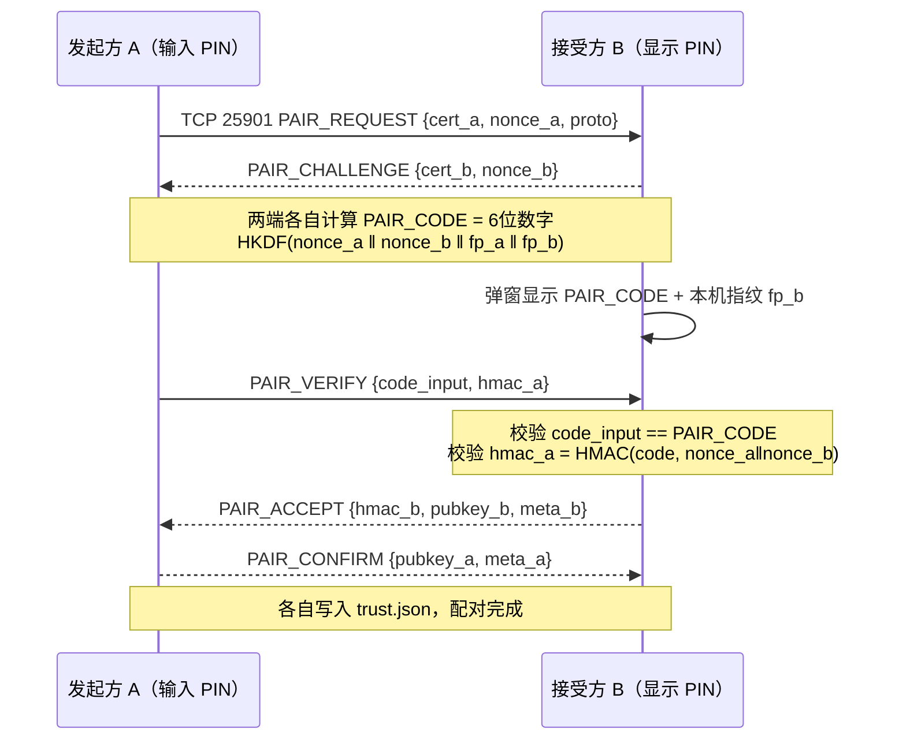

# LiteKVM 发现与配对协议规格 v0.1

> 状态：草案（Draft）　|　适用版本：proto=v1　|　读者：实现者（AI subagent / 贡献者）

## 1. 目标

让两台装了 LiteKVM 的电脑在**同一局域网内零配置互认**：自动发现 → 一键发起 → 输入 6 位 PIN → 永久互信。全程无需账号、无云依赖。

## 2. 设备身份模型

- 每台设备首次启动时生成 **Ed25519 密钥对**，私钥永不离开设备。
- 私钥存储：Windows `%APPDATA%/LiteKVM/identity.key`（DPAPI 加密）；macOS `~/Library/Application Support/LiteKVM/identity.key`（文件权限 600）。
- `device_id` = 公钥的 SHA-256 前 16 字节 hex（32 字符），设备终身不变。
- 指纹（用于人工比对）：SHA-256(公钥) 的前 8 字节，格式化为 `AB:CD:EF:12:...` 4 组展示。

```cpp
// C++20 风格伪代码
struct DeviceIdentity {
    std::array<uint8_t, 32> public_key;
    std::array<uint8_t, 64> private_key;   // Ed25519 seed+pub
    std::string device_id() const;          // sha256(pub)[0..16] hex
    std::string fingerprint() const;        // sha256(pub)[0..8] 分组展示
};
```

## 3. mDNS 发现

| 项 | 值 |
|---|---|
| 服务类型 | `_litekvm._tcp.local.` |
| 配对端口 | TCP **25901**（TXT 中声明） |
| 广播间隔 | 首次上线连发 3 条（间隔 1s），之后被动应答查询为主 |
| 存活判定 | TTL 内未刷新即从「附近列表」移除；列表 UI 刷新周期 2s |

### TXT 记录字段

```
device-id=9f8e7d6c5b4a3210fedcba9876543210   # 必填，32hex
name=大叔的书房台式机                         # 可显示名，UTF-8
platform=win|mac|linux                       # 必填
fp=1a2b3c4d5e6f7788                          # 公钥指纹前8字节hex（防撞库快速比对）
proto=v1                                     # 协议版本，不符则不显示可配对
port=25901                                   # 配对服务端口
state=pairable|paired|busy                   # pairable=可接受新配对
```

### 多网卡重复广播去重

同一 device-id 可能经多个网卡广播出多条记录（如同时连网线和 Wi-Fi）。去重规则：
- 以 `device_id` 为唯一键；保留**最后收到**的一条作为当前地址。
- UI 显示单张卡片；连接时按记录地址依次尝试。

## 4. 配对流程（PIN 六位码）

### 时序图



### PAIR_CODE 派生算法

```cpp
// 双端独立计算，结果必须一致；不传网络上，杜绝窃听
uint32_t derive_pair_code(bytes nonce_a, bytes nonce_b,
                          string fp_a, string fp_b) {
    bytes ikm = nonce_a | nonce_b | from_hex(fp_a) | from_hex(fp_b);
    bytes okm = HKDF_SHA256(ikm,
                            salt = "litekvm-pair-v1",
                            info = "PAIR_CODE",
                            len = 4);
    return load_u32(okm) % 1000000;        // 000000-999999，补齐前导零显示
}
```

### 消息帧格式

TCP 长度前缀帧（2 字节 big-endian 长度 + JSON payload），所有消息外层：

```json
{ "type": "PAIR_REQUEST", "v": 1, ... }
```

| 消息 | 方向 | 字段 |
|---|---|---|
| PAIR_REQUEST | A→B | cert_a（自签证书 PEM）、nonce_a（32B 随机）、proto |
| PAIR_CHALLENGE | B→A | cert_b、nonce_b（32B 随机） |
| PAIR_VERIFY | A→B | code_input（用户输入的 6 位）、hmac_a |
| PAIR_ACCEPT | B→A | hmac_b、pubkey_b、meta_b{name,platform} |
| PAIR_CONFIRM | A→B | pubkey_a、meta_a |

错误响应统一：`{ "type":"PAIR_ERROR", "code": "..." }`，码表见 §7。

## 5. 安全分析

### 重放防护
- nonce_a/nonce_b 均为 32 字节 CSPRNG 随机数，会话结束即失效。
- 同一 nonce 组合在 60 秒窗口内只接受一次；B 端维护 `(nonce_a,nonce_b) → seen` 的短期缓存。

### MITM 防护
- PIN 由双向 nonce + 双方指纹派生：攻击者若劫持信道，其转发内容会导致两端算出的 PAIR_CODE 不一致或 HMAC 校验失败。
- 配对成功弹窗同时展示对端指纹 `fp`，安全敏感用户可与对方屏幕上的指纹肉眼比对（类比 SSH known_hosts）。

### 暴力破解限速
- PAIR_VERIFY 连续错 **5 次**：本次会话终止并锁定配对端口 **10 分钟**（状态转 `busy`，mDNS TXT 同步更新）。
- 锁定期间新 PAIR_REQUEST 直接回 `RATE_LIMITED`。

### 密钥确认（防转录错误）
- PAIR_ACCEPT 后双方用交换到的公钥各签一份 transcript hash（所有先前消息的 SHA-256），互相验签——确保密钥交换完整未被篡改。

## 6. trust.json（信任库）

路径：`%APPDATA%/LiteKVM/trust.json`（Win）/ `~/Library/Application Support/LiteKVM/trust.json`（macOS）

```json
{
  "version": 1,
  "devices": [
    {
      "device_id": "9f8e7d6c5b4a3210fedcba9876543210",
      "pubkey": "<base64>",
      "name": "客厅笔记本",
      "platform": "mac",
      "paired_at": "2026-08-25T13:20:00Z",
      "last_addr": "192.168.1.23",
      "last_seen": "2026-08-25T14:01:22Z"
    }
  ]
}
```

- **重连认 device_id 不认 IP**：IP 变化（DHCP/换网络）不影响信任关系；mDNS 或上次地址探测到新 IP 即重连。
- 撤销信任：UI 删除条目 → 同时向对端发送 UNPAIR 通知（尽力而为，对端离线则下次连接时同步删除）。

## 7. 错误码表

| code | 含义 | 客户端表现 |
|---|---|---|
| TIMEOUT | 30s 无进展 | 提示网络不稳定，可重试 |
| REJECTED | 对方点了拒绝 | 提示已拒绝 |
| WRONG_CODE | PIN 错误（累计计数） | 抖动输入框，剩余次数提示 |
| RATE_LIMITED | 触发限速锁定 | 显示剩余锁定秒数 |
| PROTO_MISMATCH | proto 版本不符 | 引导双方升级 |
| BUSY | 对方正忙（已有配对进行中） | 稍后再试 |

## 8. 实现任务拆解（TDD，供 subagent 直接执行）

1. [ ] `identity_test.cpp`：生成 Ed25519 密钥对 → device_id/fingerprint 格式断言（2min）
2. [ ] 实现 `DeviceIdentity::load_or_create()`：首启生成、二次启动加载一致（3min）
3. [ ] `trust_store_test.cpp`：trust.json 写入→读回→字段完整（2min）
4. [ ] mDNS 广播：QDnsServiceBrowse 注册 `_litekvm._tcp.`，TXT 七字段齐全（5min）
5. [ ] mDNS 扫描：发现测试实例（本机双网卡自见），多网卡去重逻辑（5min）
6. [ ] 配对 TCP server：25901 监听、长度前缀帧编解码 roundtrip 测试（3min）
7. [ ] PAIR_CODE 派生：固定 nonce 向量测试双端一致性（2min）
8. [ ] 全流程集成测试：本机起 A/B 两实例，脚本化完成一次配对，断言 trust.json 双方各有对方（5min）
9. [ ] 限速测试：连续 5 次 WRONG_CODE 后第 6 次返回 RATE_LIMITED（3min）
