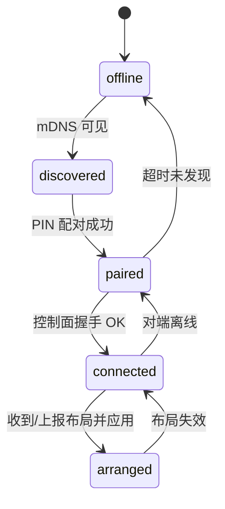

# LiteKVM 组网角色协商与布局同步规格 v0.1

> 状态：草案（Draft）　|　适用版本：proto=v1　|　前置：[discovery-pairing-spec.md](discovery-pairing-spec.md)

## 1. 目标

已配对的多台设备组成 mesh：**自动决定谁是 server（被谁的键鼠控制）/ client**，布局（屏幕相对位置）在全网自动同步——对标 INGcontrol 的「电脑排列」体验，但完全 P2P 无云。

## 2. 角色协商

### 规则

- 已配对设备集合中，`device_id` **字典序最小者 = server**，其余全部为 client。
- server 承载输入流：它的键盘鼠标事件通过 Deskflow 数据通道发往各 client。
- 所有设备运行相同的控制面守护（TCP 25902），只是角色不同。

```cpp
// 伪代码
DeviceId elect_server(const std::set<DeviceId>& paired_online) {
    return *paired_online.begin();   // std::set 有序，begin 即字典序最小
}
```

### 断连与重选

- 任一设备离线：剩余集合重选 server。
- **5 秒滞回（hysteresis）防抖**：网络闪断 <5s 不触发重选；重选后旧 server 回归不抢回（除非它仍是最小 id）。
- 重选期间数据面连接保持不断（Deskflow 连接按对维护，角色切换只改输入流向开关）。

### 状态机



## 3. 控制面协议（TCP 25902）

- 长度前缀帧 + JSON（同配对协议），节点间全互联（n 台设备 = n-1 条控制连接，由 id 大者主动连 id 小者）。
- 心跳：每 10s `PING/PONG`，3 次未回判定离线。

### 消息表

| 消息 | 说明 |
|---|---|
| HELLO {device_id, rev} | 握手，携带自己缓存的布局版本 |
| LAYOUT_UPDATE {rev, updated_by, ts, screens[]} | 全量布局广播 |
| LAYOUT_REQUEST {} | 向任意在线节点拉最新布局（重连补齐用） |
| ROLE_ANNOUNCE {server_id, epoch} | 广播当前 server 与代数（每次重选 epoch+1） |

## 4. 布局模型与同步

### JSON Schema

```json
{
  "rev": 42,
  "updated_by": "9f8e7d6c...",
  "ts": "2026-08-25T13:30:00Z",
  "screens": [
    { "device_id": "9f8e7d6c...", "x": 0,   "y": 0, "w": 2560, "h": 1440 },
    { "device_id": "a1b2c3d4...", "x": 2560,"y": 0, "w": 1920, "h": 1080 },
    { "device_id": "e5f6a7b8...", "x": 2560,"y": -1080, "w": 1920, "h": 1080 }
  ]
}
```

- 坐标系：虚拟桌面平面，主屏左上角 (0,0)，允许负坐标（屏在上/左侧）。
- `w/h` 取各设备主显示器物理分辨率，UI 拖拽只改 `x/y`。

### 冲突解决

- **LWW-by-rev**：`rev` 单调递增（每台设备持久化自己的 last_rev，新布局 rev = max(已知 rev)+1）。
- 收到 LAYOUT_UPDATE：`rev > 本地 rev` → 应用并转发给其他邻居（洪泛式，去环靠 rev+updated_by 幂等）；`rev ≤ 本地` → 忽略并回送本地最新（帮助对方收敛）。
- 并发编辑（两台同时拖拽）：两者都产生新 rev，先扩散者胜，后者收到更高 rev 自动覆盖——最终一致。

### 离线补齐

- 设备重连 → HELLO 带 `rev=17`，邻居发现比自己高 → 回送最新 LAYOUT_UPDATE。
- 若全网都只有旧版而本机有新版（极端分区后回归）：本机直接广播即可。

## 5. 与 Deskflow core 的集成边界

**原则：discover/pairing/mesh 全部自建（src/litekvm/），不动上游 core 协议。**

| 层 | 归属 | 说明 |
|---|---|---|
| mDNS 发现 / PIN 配对 / 布局同步 | LiteKVM 自建 | 25901/25902 端口，独立于 deskflow 数据通道 |
| 输入注入 / TLS 加密传输 / 文字剪贴板 | Deskflow core 白拿 | 由我们生成/更新其配置文件并热加载 |
| 配置落地 | 桥接层（新增） | 把 mesh 角色协商结果翻译成 deskflow 的 server/client 配置并 reload |

需要触碰的上游文件最小集合：
1. GUI 主窗口：加「附近的电脑」侧栏入口（新增文件为主，MainWindow 插桩一处）。
2. `deskflow-core` 进程管理：暴露"以指定角色重启核心"的内部 API（上游已有类似逻辑，包一层）。
3. 其余零侵入。

## 6. 实现任务拆解（TDD）

1. [ ] `layout_test.cpp`：JSON schema 解析/序列化 roundtrip、负坐标合法（3min）
2. [ ] rev 单调性测试：并发两条 LAYOUT_UPDATE 收敛到同一份（3min）
3. [ ] 洪泛去环：三角拓扑 A-B-C，A 发起更新，B/C 各恰收到一次有效应用（5min）
4. [ ] 角色选举：给定 device_id 集合断言 server 选择；移除最小者后重选正确（2min）
5. [ ] 5 秒滞回：模拟 3 秒闪断不触发 ROLE_ANNOUNCE（3min）
6. [ ] 控制面互联：3 节点全互联建链、心跳超时判离线（5min）
7. [ ] 离线补齐：C 离线期间 rev 42→45，C 重连后 HELLO 补齐到 45（5min）
8. [ ] 桥接层：把协商结果写成 deskflow 配置文件格式并触发 reload（单测 mock）（5min）
